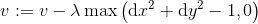

# GridMap: A simple 2D continuous maze environment for reinforcement learning training

## Introduction

GridMap is a simple 2D environment in which the user could build a maze for training reinforcement learning models. Although there is a 'Grid' built in the naming, GridMap is designed to work in a continuous coordinate space. 

In GridMap, a map is defined in a rectangular 2D plane with the plane boundaries as the map borders. Obstacles are specified by indexing and created as "blocks". A starting block and an ending block could be defined. There is an agent in the GridMap observing its continuous coordinate. The agent could make movement in the map without going into the obstacles and out of any boundaries. The agent starts it's journey from the starting block and its task is to find the ending block. 

The user could specify reward values for the following cases:

- Agent ends up in a normal grid.
- Agent goes out of boundary but blocked by the border.
- Agent goes into an obstacle but blocked by the obstacle.
- Agent goes back to the starting block.
- Agent goes into the ending block or arrives at a point that is in a circle pre-defined around the ending block.

GridMap use JSON files to save the environments along with the state-action pairs of the agent. The user could render the map and state-action history into a figure.

This simple 2D environment is used by the authors to prove their concepts in the research related to deep reinforcement learning.

## Install

```
python setup.py install --record files.txt
```

Currently, to uninstall, the user has to use the recorded file list stored in `files.txt` during the installation.

```
cat files.txt | xargs rm -rf
```

## Simple classes.

GridMap defines some simple basic classes to work with.

### Class BlockCoor
Represents a 2D coordinate.

### Class BlockCoorDelta
Represents a change of 2D coordinates.

### Class BlockIndex
Represents an index of a block.

### Class Block
Represents a Block in GridMap. `Block` is further inheritated to `NormalBlock`, `ObstacleBlock`, `StartingBlock`, and `EndingBlock`. A `Block` posses a value property as its 'value' for an agent ending up inside of on its border.

### Class GridMap2D
Represents the map with all kinds of blocks.

### Class GridMapEnv
Represents a GridMap environment which contains a map. GridMapEnv provides the user with the `reset()`, `step()`, and `render()` interfaces similar to those defined by the gym package.

### Class GME_NP
A helper class designed for reinforcement learning training.

## Create a map

A map with all grids as the `NormalBlock`s is created by defining an object of GridMap2D. The user has to specify the row and column numbers of the map, the grid size (`stepSize`) of the map. Optionally, a name of the map and the value of an agent being out of the boundary could be set as well.

After object creation, the `initialize()` method should be explicitly called to initialize the map.

Then the user could add obstacles by `add_obstacle()` member function and set the starting and ending block by using `set_starting_block()` and `set_ending_block()` functions.

GridMap2D provides various member functions to get access to the internal settings, like the values for different block types.

## Create an environment

Once we have a GridMap2D object as a map, to create an environment, it could be as simple as referring to this map. When creating a `GridMapEnv` object, the user could set the name of the environment and set the working directory at the same time.

In our reinforcement learning study, it is required that the interactions between the environment and the reinforcement learning algorithm are carried out thought NumPy objects. To do this, we provide an interfacing class, `GME_NP` defined in `EnvInterfaces.py` file. There are no major differences between the creation of a `GridMapEnv` ojbect and a `GME_NP` object.

## Saving and loading environments

The user could use the member functions `save()` and `load()` to write or read back an environment and its associated map to of from the file system. When using `save()` the writing destination will be the location defined by the working directory. However, for `load()`, the user has to specify the filename of the environment as well as the directory where the file resides. 

Similar to GridMap2D objects, an environment is saved as a JSON file. The user is wellcome to take a look at it and see various settings `GridMapEnv` provides.

## Interact with the environment

Interactions with an `GridMapEnv` object or a `GME_NP` object are happen mainly through the following interface functions.

- `reset()`: Resets the environment, places the agent back to the starting block defined by the map. Clean the state-action history and the accumulated rewards from the environment. The initial state will be returned.

- `step()`: Make a single interaction, moving in a specific direction with a certain length of 'step', we define this as an 'action'. By default, the length of an action is not limited, however, the resultant of the action will be determined by the boundaries and the obstacles of the map. The rules of actions are listed later in this section. `step()` returns four objects, namely the new state, the value/reward, the termination flag, and a fourth object that is for compatibility with other system and not used currently. The user should check the termination flat every time he/she called `step()`. Calling `step()` with the environment being in the termination state will cause an exception to be raised. To restart, use `reset()`.

- `render()`: Drawn the map with all the state-action pairs happend up to the current time. This function is currently a naive implementation a has protentially poor performance in terms of graphics. Call this function at the beginning of the training to observe the map and call this function at the end of the training to see the state-action history. The user is encouraged to call `finialize()` if a call to `render()` is made before using `reset()` to start a new interaction session.

There are other interface functions that a user could use to interact with the environment or configure different settings.

### Basic interaction

As mentioned earlier, interactions are mainly taken out by using `reset()` to initialize, several `step()` to make actions and collect reward, some calls to `render()` to visually see the map and the interaction history.

By issuing `step()`, the user is moving the agent around in the map. `reset()` always place the agent at the center of the starting block. Each time the user calls `setp()`, an action defined as `BlockCoorDelta` should be supplied. The environment determines the resultant state, the 2D coordinate, of the agent based on the current state and the action the user chooses to take. The following rules are applied:

The agent tries to move in the direction defined by the action,
- If the agent goes out of any boundaries of the map before it reaches the destination, it stops at the boundary along its way. The agent receives a reward/penalty from the environment (configured as a property of the map, the value for being outof boundary).

- If the agent is at a boundary and the action makes it try to go further into the outer region of the map, the agent would not move at all and will receive a reward/penalty from the environment as being out of the boundary.

- If the agent chooses to stay at a boundary, it receives the same reward/penalty as being out of boundary.

- If the agent goes across an obstacle as directed by the action, it stops at the grid lines of the obstacle along its way. The agenet receives a reward/penalty from the environment defined by the obstacle block the agent is hitting on.

- If the agent is at a grid line of an obstacle and it tries to go across the obstacle, it will not move at all and will receive a reward/penalty from the envrionment as being hitting an obstacle.

- If the agent stays at the grid line of an obstacle, it is the same as hitting the obstacle.

- If the agent moves to the destination (not an ending block) defined by the action and does not go out of boundary or go into any obstacles, the environment gives it a reward/panelty defined by this `NormalBlcok`.

- If the agent makes to the ending block before going out of boundary or hitting any obstacles, the agent receives a reward and the current session terminates. A termination flag is set. Any further call to `step()` result in rasing an exception. Use `render()` to see the result and `reset()` to start over.

Since we are in a continuous space, there are some special cases:

- If the agent tries to move along a boundary, this is treated as going out of boundary. The agent will not move at all and will receive a reward/penalty from the environment.

- If the agent tries to move along a grid line of an obstacle, this is treated as hitting the obstacle. The agent will not move at all and will recieve a reward/penalty from the environment.

- If the agent goes across the ending block, it is not considered as a termination. No reward will be given regarding the crossing over the ending block. The reward/penalty is determined by the actual ending position.

- If the agent goes across the ending block and goes out of the boundary neighboring the ending block. The agent will stop at the boundary. This is not considered as being inside the ending block. It is considered as being out of boundary and the agent receives the reward/penalty of being out of boundary.

- If the agent goes across the ending block and hits an obstacle neighboring the ending block. The agent will stop at the grid line of the obstacle. This is not considered as being inside the ending block. It is considered as being hitting the obstacle and the agent receives the reward/penalty of hitting that obstacle.

- If the agent stops right at the grid line of the ending block, it is not considered as reaching the ending block. The reward/penalty is from the normal block or obstacle or out-of-boundary depending on the type of the neighboring block.

- If the agent lands at the intersection point of two or three obstacles, it will receive rewards/penalties from all the obstacles.

- If the angnt lands at the intersection point of a boundary and an obstacle, it will receive both rewards/penalties for being out of boundary and hitting an obstacle at the same time.

### Settings

- `GridMap2D.set_value_normal_block()`: Set the reward/penalty for ending up in a normal block. Call this function before `GridMap2D.initialize()`.

- `GridMap2D.set_value_obstacle_block()`: Set the reward/penalty for hitting an obstacle. Call this function before `GridMap2D.initialize()`.

- `GridMap2D.set_value_starting_block()`: Set the reward/penalty for returning into the starting block. Call this function before `GridMap2D.initialize()`.

- `GridMap2D.set_value_ending_block()`: Set the reward for reaching the ending block. Call this function before `GridMap2D.initialize()`.

- `GridMap2D.set_value_out_of_boundary()`: Set the penalty for being out of the boundary. Call this function before `GridMap2D.initialize()`.

- `GridMap2D.set_starting_block()`: Set the index of the starting block. Original starting block will be automatically deleted. If the target index is already assigned to an ending block, an exception will be raised. Call this function after `GridMap2D.initialize()`.

- `GridMap2D.set_ending_block()`: Set the index of the ending block. Original ending block will be automatically deleted. If the target index is already assigned to a starting block, an exception will be raised. Call this function after `GridMap2D.initialize()`.

- `GridMap2D.add_obstacle()`: Add an obstacle into the map. If the target index is a starting or ending block, an exception will be raised. Call this function after `GridMap2D.initialize()`.

- `GridMap2D.random_starting_block()`: Randomize the index of the starting block. Original staring block will be automatically deleted. The new starting block will not overwrite any existing ending block or obstacle. Call this function after `GridMap2D.initialize()`.

- `GridMap2D.random_ending_block()`: Randomize the index of the ending block. Original ending block will be automatically deleted. The new ending block will not overwrite any existing starting block or obstacle. Call this function after `GridMap2D.initialize()`.

- `GridMapEnv.set_working_dir()`: Configure the working direcotry for the environment.

- `GridMapEnv.set_max_steps()`: Set the maximumn interactions allowed for a single epsiode.

- `GridMapEnv.enable_nondimensional_step()`: Switch to non-dimensional step mode. Use `disable_nondimensional_step()` to turn it off.

- `GridMapEnv.enable_action_clipping()`: Set the minimum and maximum step length. The uppper and lower clipping bounds will be used according to the mode of step (dimensional or non-dimensional). Use `disable_action_clipping()` to turn it off.

- `GridMapEnv.enable_normalized_coordinate()`: If this function is called, the state value returned by `step()` function will be normalized to [0, 1], with 0 being the smallest coordinate and 1 the maximumn. Use `disable_normalized_coordinate()` to turn it off.

- `GridMapEnv.enable_random_coordinating()`: If this function is called, a random noise will be added to the action. The random noise is expressed by a zero-mean Gaussian distribution and the user has to specify the standard variance by calling this function. The random noise will be added to be propotional to the magnitude of the action the agent is trying to take, not based on the actial action length performed by the environment taking consideration of the boundaries and obstacles along the path. Use `disable_random_coordinating()` to turn it off.

- `GridMapEnv.enable_action_value()`: A special per-action penalty is added to the reward/penalty value returned by `step()`. This per-action value is used for the purpose of the authors' research. The user could modify its defination in the code of `step()`. Currently, this per-action penalty is defined based on non-dimensional action and expressed as



where _v_ is the value, \lambda is a factor. This per-action value penalize any attempt to make an action with magnitude over 1.

- `GridMapEnv.random_starting_and_ending_blocks()`: Randomize the starting and ending blocks of the associated map.

- `GridMapEnv.enable_force_pause()`: Call this function to tell the environment to ignore the `pause` argument of `render()` and pause with a specific time supplied here by `enable_force_pause()`. Use `disable_force_pause()` to turn it off.

- `GME_NP.enable_stuck_check()`: Make `GME_NP` environment to check if the agent gets stuck to a single position. The use could supply a maximum number of stuck actions and a penelty value for reaching this number. If stack check is enabled and an agent reaches the maximum allowed stuck number at a specifice position, the environment will terminate. Stuck check does not sum stuck counts for different positions. Use `disable_stuck_check()` to turn it off.

## Replay a state-action history

After interacting with the envrionment by a sequence of `step()` calls, the user could issue a `render()` to replay the state-action history up to the current step. When clling `render()`, the user could define a pause time (decimal number in seconds) and a filename. If a pause time is defined as larger than zero, the rendered figure will pause for that time and then disappear. If a non-positive value is specified as the pause time, the rendered figure will not be closed and the user could use the Q key on the keyboard to close the figure. When a filename is supplied, the rendered figure will be saved as an image. The user should only specify the filename without any preceding paths. The actual storing directory is specified as the `Render` subdirectory under the working directory.

To save the rendered figure as an image, the user has to explicitly specify `True` for the argument `flagSave` of the `render()` function. The user could chose to ommit the `fn` argument and only set the `flagSave` argument. This results in writing a rendered image with a composed filename. The file name is defined as "Envrionment name_action counts-maximum allowed steps_total reward value.png".

## Sample code.

By running the tests, there will be maps and envrionments generated and saved. The user could exam the test codes and taking them as examples.

### Sample map and environment JSON files.

Here is a sample map with 10x10 grids. The starting block is (2, 2) and the ending block is (8, 8), both are using index numbers. Index begins with zero. There is a line of 6 obstacles. Note that `stepSize` is not the step size for an agent. It is for defining the actual size of the map. This map is visualized as the following image.

```json
{
    "cols": 11, 
    "endingBlockIdx": [ 8, 8 ], 
    "endingPoint": [ 8.5, 8.5 ], 
    "haveEndingBlock": true, 
    "haveStartingBlock": true, 
    "name": "S0202_E0808", 
    "obstacleIndices": [
        [ 5, 2 ], 
        [ 5, 3 ], 
        [ 5, 4 ], 
        [ 5, 5 ], 
        [ 5, 6 ], 
        [ 5, 7 ], 
        [ 5, 8 ]
    ], 
    "origin": [ 0, 0 ], 
    "outOfBoundValue": -10, 
    "rows": 11, 
    "startingBlockIdx": [ 2, 2 ], 
    "startingPoint": [ 2.5, 2.5 ], 
    "stepSize": [ 1, 1 ], 
    "valueEndingBlock": 100, 
    "valueNormalBlock": -0.1, 
    "valueObstacleBlock": -10, 
    "valueStartingBlock": -0.1
}
```

__Place holder for the image of the map__

By referring the above map, we define a sample environment. Here `actStepSize` is the non-dimensional step size, which is the actual step size on the map. 

- This environment enable the non-dimensional step by setting `nondimensionalStep` to `true`. The value of `actStepSize` is calculated as the product between the actual map length and the value `nondimensionalStepRatio`. Here the map is of length 11 on both sides, `nondimensionalStepRatio` is 0.1, so step size 1.0 under a non-dimensional step setting is actually 1.1 on the acutal map.

- `actionValueFactor` is the \lambda for the per-action penalty. Per-action penalty is enabled by `flagActionValue`.
- `agentActs` saves the action the agent was trying to take. It should be a list of two-element lists, similar to `agentLocs`.
- `flagActionClip` is false, so setting `actionClip` has no effects. 
- Random coordinating is enabled by `isRandomCoordinating` and the standard variance is set to be `randomCoordinatingVariance`.
- Enable normalized coordinate by setting `normalizedCoordinate` to `true`.

Other entries are self-explainable

- `agentCurrentAct`: The current action the angent is trying to take.
- `agentCurrentLoc`: Current locaiton (coordinate) of the agent.
- `isTerminated`: `true` if the envrionment has terminated due to 1) the agent reaches the ending block, 2) mamximum steps is reached.
- `mapFn`: The filename of the map JSON file.
- `maxSteps`: The maximum steps allowed for a single episode.
- `nSteps`: Number of steps already taken in the current episode.
- `name`: The name of the environment.
- `totalValue`: The total reward value the agent has collected up to now.
- `visAgentRadius`: The circle radius of the agent on the rendered image.
- `visForcePauseTime`: The pause time of the `enable_force_pause()` function. 
- `visIsForcePause`: Equivalent to calling `enable_force_pause()`.
- `visPathArrowWidth`: Actions of an agent will be represented as arrows. This is the width of the arrow.

```json
{
   "actStepSize": [ 1.1, 1.1 ], 
   "actionClip": [ -1, 1 ], 
   "actionValueFactor": 5.0, 
   "agentActs": [], 
   "agentCurrentAct": [ 0, 0 ], 
   "agentCurrentLoc": [ 2.5, 2.5 ], 
   "agentLocs": [
      [ 2.5, 2.5 ]
   ], 
   "endPointMode": 1, 
   "endPointRadius": 1.0, 
   "flagActionClip": false, 
   "flagActionValue": true, 
   "isRandomCoordinating": true, 
   "isTerminated": false, 
   "mapFn": "RSE_13_1_GMEnv_Map.json", 
   "maxSteps": 100, 
   "nSteps": 0, 
   "name": "GridMapEnv_01", 
   "nondimensionalStep": true, 
   "nondimensionalStepRatio": 0.1, 
   "normalizedCoordinate": true, 
   "randomCoordinatingVariance": 0.2, 
   "totalValue": 0, 
   "visAgentRadius": 0.1, 
   "visForcePauseTime": 0.001, 
   "visIsForcePause": true, 
   "visPathArrowWidth": 0.1
}
```

### Read an envrionment with map and interact.
